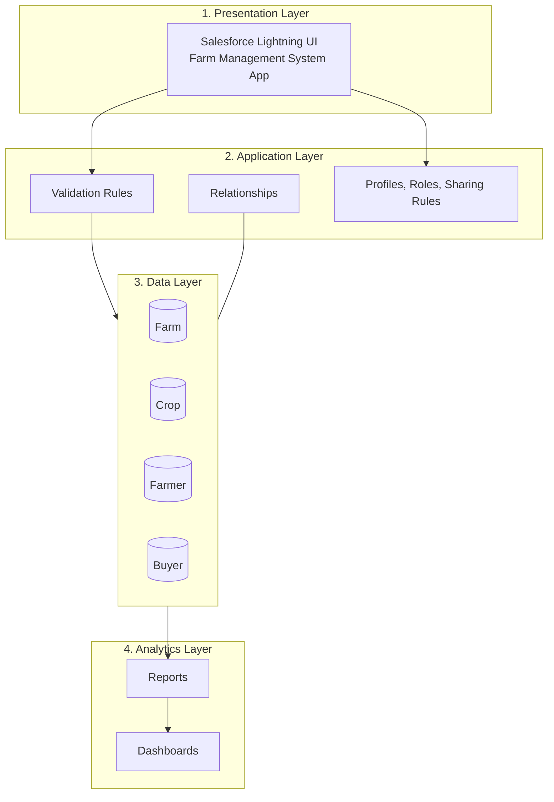
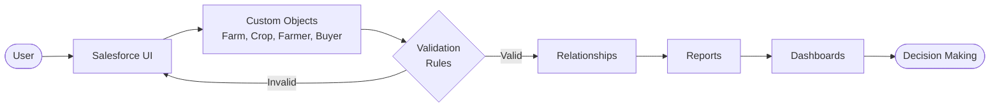
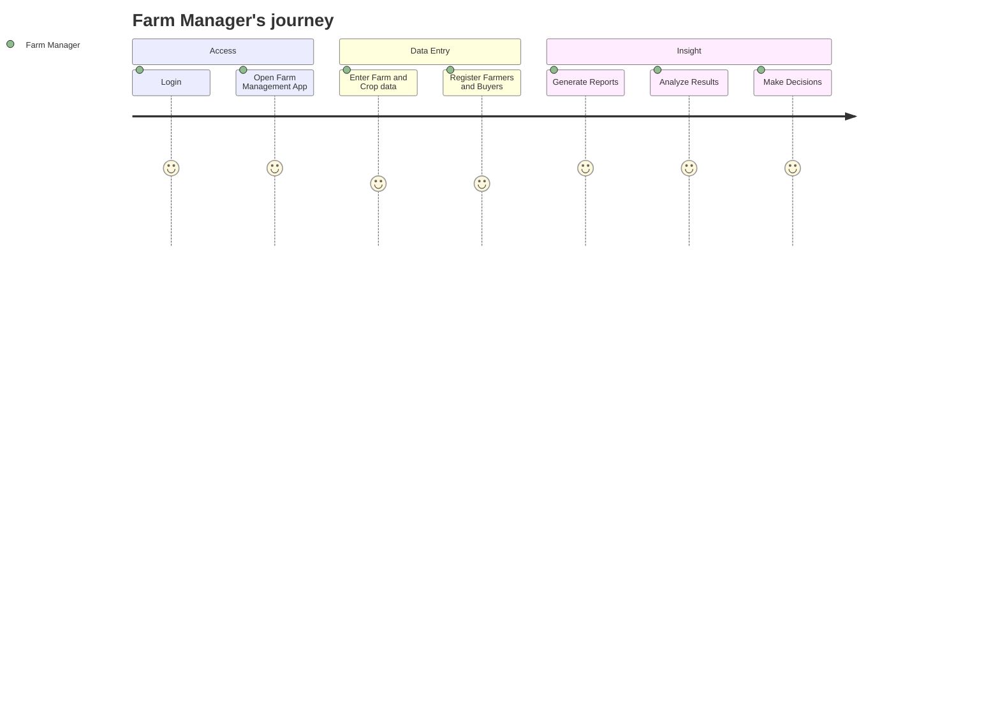
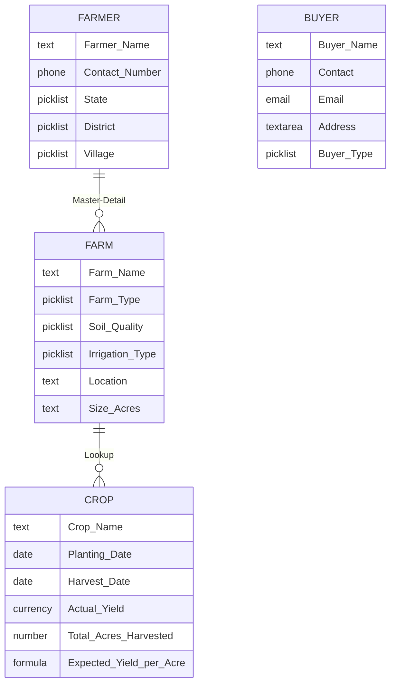
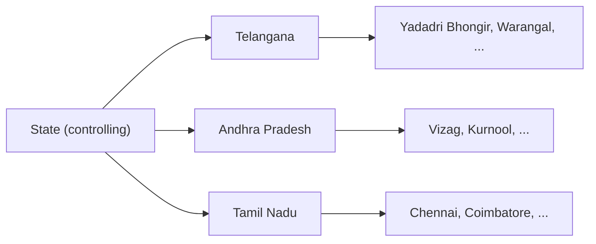
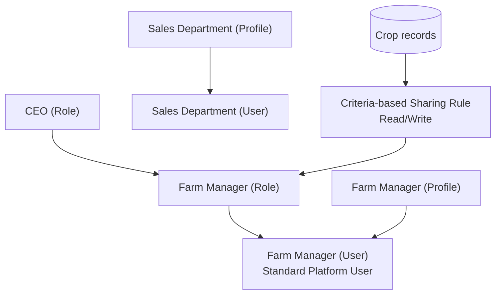

## 🎥 Salesforce-Chai-Shop-Project 

## 📄 Project Documentation

👉 [View Project Documentation](https://docs.google.com/document/d/1FbPT1Hqdr234FrJAPGVoxi3OZ-jk1SRQ/edit?usp=sharing&ouid=117348299494960774316&rtpof=true&sd=true)

## 🎥 Salesforce-Chai-Shop-Project video 

[▶️ **Watch Project  Video**](https://drive.google.com/file/d/1vPo0gpPMZeCey3ruIWhNY6yv3d56a2Nm/view?usp=sharing)

# 🌾 Farm Management System (FMS)

A **Salesforce-based application** that digitizes and streamlines agricultural operations. It manages data for **farms, crops, farmers, and buyers**, and gives real-time insight through **reports and dashboards**.

> **Course:** Salesforce Administrator with Agentforce
> **Team ID:** SWTID-2026-7140

---

## 📑 Table of Contents

- [Project Overview](#-project-overview)
- [Purpose](#-purpose)
- [Problem Statement](#-problem-statement)
- [Features](#-features)
- [Technology Stack](#-technology-stack)
- [System Architecture](#-system-architecture)
- [Data Model](#-data-model)
- [Implementation Milestones](#-implementation-milestones)
- [Setup Guide](#-setup-guide)
- [Testing](#-testing)
- [Advantages & Disadvantages](#-advantages--disadvantages)
- [Future Scope](#-future-scope)
- [Team](#-team)

---

## 📌 Project Overview

The Farm Management System (FMS) replaces manual registers and scattered spreadsheets with a centralized, secure, cloud-based platform. Farmers, farm managers, buyers, and administrators can record data, enforce validation, control access by role, and analyze results, all inside Salesforce Lightning.

## 🎯 Purpose

- Digitize agricultural data management
- Improve data accuracy and accessibility
- Automate record handling
- Enable real-time monitoring
- Support data-driven farming decisions
- Enhance productivity and transparency

## ❗ Problem Statement

| Persona | Trying to | But | Because | Feels |
|---|---|---|---|---|
| Farmer | Maintain farm and crop records | Data is incomplete or incorrect | Records are kept manually in registers | Frustrated and confused |
| Farm Manager | Monitor productivity and sales | Reports are delayed and inaccurate | Data is scattered across files and sheets | Stressed and inefficient |
| Buyer | Access crop availability and pricing | Information is not updated regularly | No centralized digital system | Uncertain and dissatisfied |
| System Admin | Manage user access and security | Unauthorized access may occur | Access control is handled manually | Concerned |

## ✨ Features

- 🔐 **User authentication** and role-based access control
- 🗂️ **Four custom objects:** Farm, Crop, Farmer, Buyer
- 🔗 **Relationship mapping** (Master-Detail and Lookup)
- ✅ **Data validation** for dates, quantities, and mandatory fields
- 🔽 **Dependent picklists** (State → District)
- 🧮 **Formula field** for expected yield per acre
- 📊 **Reports** and 📈 **interactive dashboards**
- 🤝 **Sharing rules** for secure collaboration

## 🛠 Technology Stack

| Layer | Technology |
|---|---|
| Frontend | Salesforce Lightning UI |
| Backend | Salesforce Platform |
| Database | Salesforce Cloud |
| Automation | Validation Rules |
| Analytics | Reports & Dashboards |

## 🏗 System Architecture

### Layered architecture

### Data flow

### User journey

## 🗃 Data Model

### Entity relationship diagram

### Field dependency (State → District)

### Field details

### Farm
| Field | Type |
|---|---|
| Farm Name | Text (record name) |
| Farm Type | Picklist: Crop, Livestock, Mixed |
| Soil Quality | Picklist: Organic, Cover Crops, Composting |
| Irrigation Type | Picklist: Sprinkler, Drip, Localized |
| Location | Text |
| Size (Acres) | Text |
| Farmer | **Master-Detail** → Farmer |

### Crop
| Field | Type |
|---|---|
| Crop Name | Text (record name) |
| Planting Date / Harvest Date | Date |
| Actual Yield | Currency |
| Total Acres Harvested | Number (20) |
| Expected Yield per Acre | Formula (Currency) = Actual Yield ÷ Total Acres Harvested |
| Farm | **Lookup** → Farm |

### Farmer
| Field | Type |
|---|---|
| Farmer Name | Text (record name) |
| Contact Number | Phone |
| State | Picklist: Telangana, Andhra Pradesh, Tamil Nadu |
| District | Picklist (dependent on State) |
| Village | Picklist |

### Buyer
| Field | Type |
|---|---|
| Buyer Name | Text (record name) |
| Contact | Phone |
| Email | Email |
| Address | Text Area |
| Buyer Type | Picklist: Wholesale, Retail |

## 🚀 Implementation Milestones

```mermaid
flowchart LR
    M1["1. Developer Org"] --> M2["2. Objects"] --> M3["3. Tabs"] --> M4["4. Lightning App"]
    M4 --> M5["5. Fields and Relationships"] --> M6["6. Profiles"] --> M7["7. Roles"]
    M7 --> M8["8. Users"] --> M9["9. Sharing Rules"] --> M10["10. User Adoption"]
    M10 --> M11["11. Reports"] --> M12["12. Dashboard"] --> M13["13. Verification"]
```

### Security model

| # | Milestone | What was done |
|---|---|---|
| 1 | Salesforce | Created a Developer Org |
| 2 | Objects | Created Farm, Crop, Farmer, Buyer custom objects |
| 3 | Tabs | Created a custom tab for each object |
| 4 | Lightning App | Built the **Farm Management System** app |
| 5 | Fields & Relationships | Added fields, formula field, relationships, and State→District dependency |
| 6 | Profiles | Cloned Standard User into *Sales Department* and *Farm Manager* profiles |
| 7 | Roles | Created the *Farm Manager* role under CEO |
| 8 | Users | Created users with assigned roles and profiles |
| 9 | Sharing Rules | Criteria-based rules giving Farm Manager Read/Write access |
| 10 | User Adoption | Created sample Farmer records |
| 11 | Reports | Built the *Farmer with Farms* report |
| 12 | Dashboard | Built the *Farmers with Farms* dashboard (gauge chart) |
| 13 | Verification | Viewed reports and dashboards in the app |

## ⚙️ Setup Guide

> This project is built through Salesforce declarative configuration, so there is no code to compile.

1. **Create a Developer Org** at [developer.salesforce.com/signup](https://developer.salesforce.com/signup) and log in at [login.salesforce.com](https://login.salesforce.com).
2. **Create the objects**: *Setup → Object Manager → Create → Custom Object* for Farm, Crop, Farmer, and Buyer. Enable *Allow Reports*, *Allow Search*, and *Add Notes and Attachments related list*.
3. **Create tabs**: *Setup → Tabs → Custom Object Tabs → New* for each object.
4. **Create the app**: *Setup → App Manager → New Lightning App*, name it **Farm Management System**, and add Farm, Crop, Farmer, Buyer, Reports, and Dashboards.
5. **Add fields and relationships** as listed in the [Data Model](#-data-model), then set up the State → District field dependency on Farmer.
6. **Configure security**: create profiles, the Farm Manager role, users, and sharing rules.
7. **Build analytics**: create the *Farmer with Farms* report and the dashboard.
8. **Verify** by opening the app from the App Launcher.

## 🧪 Testing

- Creation of Farm, Crop, Farmer, and Buyer records
- Validation of input fields
- Relationship and dependency checks
- Profile and role access testing
- Sharing rule verification
- Report and dashboard generation

## ⚖️ Advantages & Disadvantages

**Advantages**
- Centralized data system
- Reduced paperwork
- Improved accuracy
- Better monitoring
- Real-time analytics

**Disadvantages**
- Requires an internet connection
- Depends on Salesforce licenses
- Limited offline access

## 🔮 Future Scope

- Mobile application integration
- AI-based crop prediction
- Weather data integration
- IoT sensor connectivity
- Government scheme integration
- Market price forecasting

## 👥 Team

| Name | Role |
|---|---|
| Tharunkumar D | Team Leader |
| Vignesh C | Team Member |
| Vignesh S | Team Member |
| Tharun R | Team Member |
| Vijay Pandiyan D | Team Member |

**College:** Shanmuga Industries Arts & Science College, Tiruvannamalai (Code: TVU209)
**University:** Thiruvalluvar University

---

